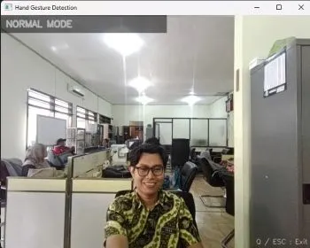
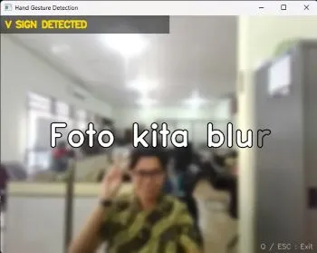
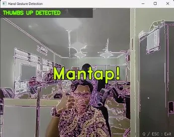
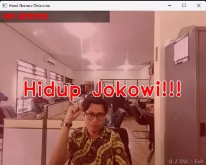

<h1 align="center">
✋ HandGestureApp
</h1>

<p align="center">
Real-time Hand Gesture Recognition using Python, OpenCV, MediaPipe and Pygame.
</p>

<p align="center">


</p>

## 📸 Preview

<p align="center">

</p>

# ✨ Features

- ✌️ Detect **V Gesture**
  - Blur Effect
  - Typewriter Animation
  - Sound Effect

- 👍 Detect **Thumbs Up**
  - Edge Detection Effect
  - Zoom Text Animation
  - Sound Effect

- ✊ Detect **Fist Gesture**
  - Red Overlay Effect
  - Punch Animation
  - Audio Playback

- 📷 Real-time Webcam Detection

- 🎵 Audio Feedback

- ⚡ High FPS Performance

- 🧩 Modular Architecture

---

# 🛠 Tech Stack

| Library | Purpose |
|----------|----------|
| Python | Main Programming Language |
| OpenCV | Camera & Image Processing |
| MediaPipe | Hand Landmark Detection |
| NumPy | Numerical Processing |
| Pygame | Audio Playback |

---

# 📂 Project Structure

```text
HandGestureApp/
│
├── assets/
│   ├── foto_blur.mp3
│   └── jokowi.mp3
│
├── core/
│   ├── app.py
│   ├── audio.py
│   ├── detector.py
│   ├── gesture.py
│   └── renderer.py
│
├── utils/
│   └── camera.py
│
├── test/
│
├── config.py
├── main.py
├── requirements.txt
└── README.md
```

---

# 🚀 Installation

Clone repository

```bash
git clone https://github.com/asepjay42/HandGestureApp.git
```

Masuk ke folder project

```bash
cd HandGestureApp
```

Buat Virtual Environment

```bash
python -m venv .venv
```

Aktifkan Virtual Environment

Windows

```bash
.venv\Scripts\activate
```

Install dependency

```bash
pip install -r requirements.txt
```

Run

```bash
python main.py
```

---

# 🎮 Gesture Mapping

| Gesture | Effect |
|----------|---------|
| ✌️ V | Blur + Typewriter |
| 👍 Thumbs Up | Edge Detection |
| ✊ Fist | Red Overlay |

---

# ⚙️ Requirements

- Python 3.11
- Webcam
- Windows 10/11

---

# 📷 Screenshots

## Blur Effect

<p align="center">

</p>

---

## Edge Effect

<p align="center">

</p>

---

## Fist Effect

<p align="center">

</p>

---

# 🔮 Future Features

- 😊 Face Detection
- 🎨 Cartoon Filter
- 🌈 Color Filter
- 📸 Save Screenshot
- 🎥 Video Recording
- 🖐 More Hand Gestures
- 🧠 Custom AI Gesture Recognition
- 🪟 Modern GUI

---

# 👨‍💻 Author

**Asep Jayalani**

Pranata Komputer

GitHub:
https://github.com/asepjay42

---

# 📄 License

This project is licensed under the MIT License.